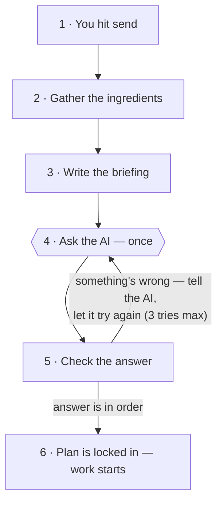

# How your task becomes a plan — explained simply

You type a task. A few seconds later the screen shows a plan: the task split into steps, each
step assigned to an app. This document explains, in plain language, exactly how that happens —
and then shows the small piece of code that does each part.

The whole story in one line: **the AI is asked exactly once to split your task and pick the
apps; everything before that moment prepares its briefing, and everything after it double-checks
the paperwork — not the wisdom of its choices.**



---

## Step 1 — You hit send

**What happens, simply.** When you press send, the browser doesn't just drop your task off and
wait. It opens a **live line** to the orchestrator — like a phone call that stays connected —
so you see each update the moment it happens: "Planning your task…", then the plan, then each
step's result, then the final answer.

The first thing the orchestrator says on that line is "Planning your task…". The second thing it
does is the planning itself — that's the rest of this document.

**The code that does it.** The browser opens the live line; the server answers it:

```js
// Browser: open the live line and listen for updates
es = new EventSource('/run?task=' + encodeURIComponent(task));
es.addEventListener('plan', e => buildSteps(JSON.parse(e.data)));   // draw the plan when it arrives
```

```python
# Server: first words on the line, then the planning call
yield ("status", {"message": "Planning your task…"})
plan = plan_task(client, registry, task, model=model)
yield ("plan", plan.to_dict())          # send the finished plan to your screen
```

---

## Step 2 — Gather the ingredients

**What happens, simply.** Before any thinking starts, the orchestrator lays out three things on
the table:

1. **The key to the AI service.** It looks for the access key in a few known places, in order —
   like checking your pocket, then your desk drawer, then the shared office drawer. If no key is
   found anywhere, the run stops right here with a clear message.
2. **The app catalogue.** A file called `apps.json` holds a **card for each of the 11 apps**.
   Each card says, in plain text: what the app is, what it's good at, examples of tasks it
   handles, and — importantly — **when NOT to use it**. Think of it as a binder of business
   cards. This binder is the *only* thing the AI will ever know about the apps.
3. **Which AI model to use.** There's a default; you can override it with a setting.

**The code that does it.**

```python
# The three ingredients, resolved in one line
return get_client("live"), load_registry(), resolve_model(None)
#      ^ the AI key       ^ the app cards   ^ which AI model
```

```python
# The model choice: your override wins, then a setting, then the default
def resolve_model(override=None):
    return override or os.environ.get("ORCHESTRATOR_MODEL") or DEFAULT_MODEL
```

---

## Step 3 — Write the briefing

**What happens, simply.** The orchestrator now writes the briefing it will hand to the AI. It
has two parts, like a rulebook plus a work order:

**Part 1 — the rulebook** (a fixed text file, kept under version control). Its key rules, in
plain words:

- Cover **everything** the user asked for. If one sentence contains three asks ("explain X,
  show code, write a blog"), that's three separate steps — don't squash them into one.
- Usually 2–5 steps. Never more than 6. Don't pad with busywork.
- Pick apps by **what the task is about**, not by matching words. "Teach me" doesn't
  automatically mean the "Teach Me" app.
- Prefer the specialist over the generalist.
- **Respect each card's "when NOT to use me" list.** If a card rules itself out, go where it
  points instead.
- If nothing fits, use the web-search app as the last resort.
- Reply with a plan in one strict format — nothing else.

**Part 2 — the work order.** All 11 app cards, plus your task, word for word, plus one final
reminder about the strict reply format.

**Why this step matters most.** The AI never sees the apps themselves — no code, no technical
details. It sees only these cards. So the quality of the routing is exactly the quality of the
card text. This is where your graphs problem came from: Coding Playground's card literally says
"to run a code snippet, use Simulated Learning" — so the AI obediently sent chart-drawing code
to an app that owns no drawing tools. The fix we parked is a *card wording* fix.

**The code that does it.**

```python
def build_user_message(registry, task):
    return (
        f"AVAILABLE APPS (JSON):\n{_registry_json(registry)}\n\n"   # the 11 cards
        f"TASK:\n{task}\n\n"                                        # your words, verbatim
        "Return the plan as one raw JSON object only."              # the strict format reminder
    )
```

Each card shows the AI exactly seven things — and nothing about how to technically call the app:

```python
return {
    "id": ...,             # the app's short name
    "name": ...,           # its display name
    "description": ...,    # what it is
    "capabilities": ...,   # what it can do
    "example_tasks": ...,  # tasks it handles well
    "when_not": ...,       # when NOT to pick it  <-- the routing steering wheel
    "fallback": ...,       # is this the last-resort web-search app?
}
```

---

## Step 4 — Ask the AI — once

**What happens, simply.** One single question to the AI does the whole job: understand the
intent, split the task into steps, and pick an app for each step. One call, not several —
cheaper, and easier to test and replay.

The call has guard rails:

- **Same question → same answer.** The AI's "creativity dial" is set to zero, so the same task
  with the same cards produces the same plan every time. That's what makes our routing test
  suite (16/16) a fair referee.
- **An answer size limit**, so a rambling reply can't grow forever.
- **A 3-minute silence rule.** As long as the AI keeps talking, it may take its time — slow is
  fine. Only *dead silence* for 3 minutes counts as failure. And there are no hidden automatic
  retries that could quietly stack into a 10-minute hang.
- **The bill is tracked.** Every call's token cost is recorded and ends up in the run log.

This is the **one moment of judgment** in the whole pipeline. Everything before it is plain
mechanical code; everything inside it is the AI's opinion, guided only by Step 3's text.

**The code that does it.**

```python
request = LLMRequest(
    model=model,
    system=system,              # the rulebook
    messages=tuple(messages),   # the work order (cards + your task)
    max_tokens=8000,            # the answer size limit
)
raw = client.complete(request)  # <-- the one AI call. 'raw' is its written answer.
```

```python
# Inside the call: no hidden retries, and the 3-minute silence rule
client = anthropic.AnthropicFoundry(..., max_retries=0, timeout=resolve_llm_timeout())
```

---

## Step 5 — Check the answer

**What happens, simply.** The AI's answer is treated like a form handed in by a stranger — it
goes through a checklist before anyone acts on it. Think of a bouncer with a clipboard:

1. Is it actually in the agreed format? (If the AI wrapped it in decoration, unwrap it rather
   than reject it on a formality.)
2. Is the "what the user wants" summary filled in?
3. Is there at least one step?
4. Does every step have an id, a title, a description, and a confidence score between 0 and 1?
5. **Does every chosen app actually exist in our catalogue?** The AI can't invent an app. And
   the app's display name is taken from *our* catalogue, never copied from the AI's answer —
   so it can't mislabel one either.
6. Did the AI accidentally write the same step twice? (Same app + same title = merge them into
   one, and fix up anything that pointed at the duplicate.)
7. Do the step orderings make sense? "Step B waits for step A" is allowed; "A waits for B while
   B waits for A" — a circle where nothing can ever start — is rejected.

If any check fails, the checker doesn't just say "no" — it writes down **exactly what was
wrong**, in one sentence. That sentence is about to matter in Step 6.

**The honest limit:** this checklist verifies the *paperwork*, not the *wisdom*. "Send plotting
code to Simulated Learning" fills in every field correctly — so it passes. A well-formed bad
idea walks straight past the bouncer. Good routing can only come from Step 3 (the cards) and is
only *tested* by our offline routing test suite.

**The code that does it.**

```python
# Check 5: the app must exist in OUR catalogue — the AI can't invent one
entry = registry.get(app_id)
if entry is None:
    raise PlanValidationError(f"subtask {sub_id!r} names unknown app_id {app_id!r}; "
                              f"valid ids: {', '.join(registry.ids())}")

app_name=entry.name,        # name comes from our catalogue, not from the AI
fallback=entry.fallback,    # same for the "last resort" flag
```

```python
# Check 7: reject circular waiting ("A waits for B, B waits for A")
_check_acyclic(subtasks)
```

---

## Step 6 — Fix or fail: the second chance, then the locked plan

**What happens, simply.** If the checklist found a problem, the orchestrator doesn't give up.
It sends the AI its own faulty answer back, together with the checker's one-sentence complaint
— "that response was invalid: *step t3 waits for a step t9 that doesn't exist*" — and asks for
a corrected version. The AI gets **3 tries in total**. Three strikes and the run stops with an
honest error card on your screen.

When an answer passes, it is sealed into a **plan that can no longer be changed** — frozen, so
nothing downstream can quietly edit it. Two facts on it (your task text and which model was
used) are stamped on by our own code, not copied from the AI's answer, so they can't be faked.
The plan is sent down the live line to your browser — the progress list and the Agent Trace you
see are drawn directly from it — and execution begins.

**The code that does it.**

```python
for _attempt in range(max_retries + 1):          # 3 tries in total
    raw = client.complete(request)               # ask (or re-ask) the AI
    try:
        return parse_plan(raw, registry, ...)    # the Step-5 checklist
    except PlanValidationError as exc:
        # Give the AI its own answer back, plus what exactly was wrong with it
        messages.append({"role": "assistant", "content": raw})
        messages.append({"role": "user", "content":
            f"That response was invalid: {exc}. "
            "Return corrected raw JSON only — no prose, no code fences."})

raise PlannerError("model did not produce a valid plan after 3 attempts ...")
```

---

## Two things this flow does NOT decide

1. **It picks the app, not the button inside the app.** Deciding *which specific feature* of the
   chosen app to use (and with what inputs — for example, the actual Python code to run) happens
   later, during execution, as a separate AI question for each step.
2. **It can't catch a bad-but-tidy plan.** As explained in Step 5, a wrong routing with perfect
   paperwork passes. The safety net for that lives outside the pipeline: our routing test suite
   (16 known tasks, currently 16/16 correct) is re-run whenever anyone touches the app cards or
   the rulebook.

## Where it can go wrong — the honest map

| Where | What goes wrong | What you see on screen |
|---|---|---|
| Step 2 | No AI access key found anywhere | An error card: "missing credentials…" |
| Step 4 | The AI goes silent for 3 minutes | An error card (the run fails cleanly, it never hangs) |
| Step 4 | The AI picks a bad app — with perfect paperwork | **Nothing** — this is the blind spot; only the routing test suite catches it |
| Step 5→6 | Sloppy paperwork (bad format, unknown app, circular waits) | Usually nothing — the AI fixes it on a retry |
| Step 6 | Three faulty answers in a row | An error card: "did not produce a valid plan after 3 attempts" |

---

*Code locations, for when you want to dig: Step 1 `web/atelier-workspace.html` + `src/orchestrator/web.py` ·
Steps 2–4 & 6 `src/orchestrator/planner.py` + `src/orchestrator/llm/foundry.py` ·
the rulebook `src/orchestrator/prompts/planner_system.md` · Step 5 `src/orchestrator/validation.py` ·
the app cards `registry/apps.json`.*
